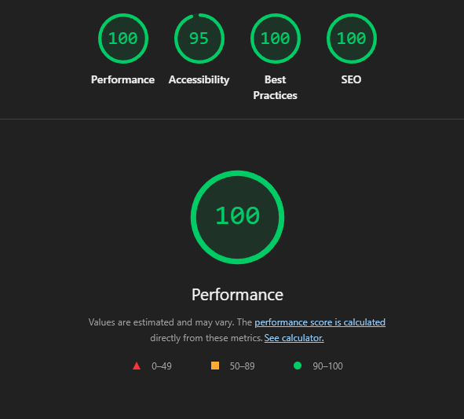
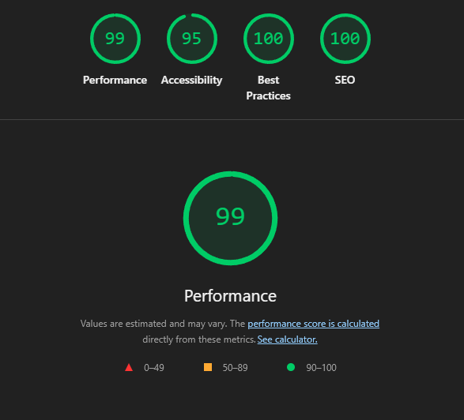

# Currency Swap WebApp

A reactive currency exchange webapp built with Next.js, TypeScript, and Tailwind CSS (hiring test)

## Quick Start

```bash
npm install
npm run dev
```

Open [http://localhost:3000](http://localhost:3000)

---

## Architecture

```
src/
├── hooks/useSwap.ts      # State management + URL sync
├── components/           # UI components
├── lib/
│   ├── swap.ts           # Calculation logic
│   ├── validation.ts     # Input validation
│   └── exchange_rates.ts # Rate data
└── types/
    ├── currency.ts       # Currency types
```

**Why this structure?**
- Separation of concerns: logic in `lib/`, state in `hooks/`, UI in `components/`
- Modularity: Keeping codebase as modular for easier maintaibility and readability

---

## Key Features

### State Management
- Single `useSwap` hook manages all swap state
- Reactive calculation to allow users to see what they're getting at what rate
- `activeField` state to track which field the user is typing in (either `input` or `output`)

### URL Sync
- State syncs to URL: `?from=USD&to=MYR&amount=100&field=input`
- Shareable links work on refresh (persistent)
- Uses `useSearchParams` + `useRouter` from Next.js
- `isInitializedRef` ensures URL is not overwritten on mount

### Race Condition Prevention
- `AbortController` cancels stale calculations (from the reactive calculation)
- Swap details are captured at click time (swap button) to prevent race conditions (e.g, if a user enters 100USD to swap, but when during the swap, the user quickly changes to 500USD, modal still shows 100USD)

### Reverse Calculation
- User can edit either input or output field
- Opposite field recalculates automatically with 1% fee factored in
- `activeField` state prevents circular loop updates

### Input Validation
- Real-time format validation (valid numbers only)
- Error codes for consistent messages (E001,E002 so far)

### Mobile-First Design
- Responsive layout (works on all screen sizes)

---

## Tech Stack

- **Framework:** Next.js
- **Language:** TypeScript
- **Styling:** Tailwind CSS
- **UI:** shadcn/ui components

---

## Deploy

```bash
npm run build
```

Deployed to Vercel

**Live URL:** [https://currency-swap-webapp-shawn.vercel.app/](https://currency-swap-webapp-shawn.vercel.app/)

---

## Performance

### Lighthouse Audit Results

#### Desktop


#### Mobile


#### Desktop Scores
| Metric | Score |
|--------|-------|
| **Performance** | 100 |
| **Accessibility** | 95 |
| **Best Practices** | 100 |
| **SEO** | 100 |

#### Mobile Scores
| Metric | Score |
|--------|-------|
| **Performance** | 99 |
| **Accessibility** | 95 |
| **Best Practices** | 100 |
| **SEO** | 100 |

### Core Web Vitals

#### Desktop
| Metric | Value | Status |
|--------|-------|--------|
| First Contentful Paint (FCP) | 0.3s | ✅ |
| Largest Contentful Paint (LCP) | 0.4s | ✅ |
| Total Blocking Time (TBT) | 0ms | ✅ |
| Cumulative Layout Shift (CLS) | 0.004 | ✅ |
| Speed Index (SI) | 0.3s | ✅ |

#### Mobile
| Metric | Value | Status |
|--------|-------|--------|
| First Contentful Paint (FCP) | 0.8s | ✅  |
| Largest Contentful Paint (LCP) | 2.0s | 🟡 |
| Total Blocking Time (TBT) | 60ms | ✅  |
| Cumulative Layout Shift (CLS) | 0.007 | ✅  |
| Speed Index (SI) | 0.8s | ✅  |
